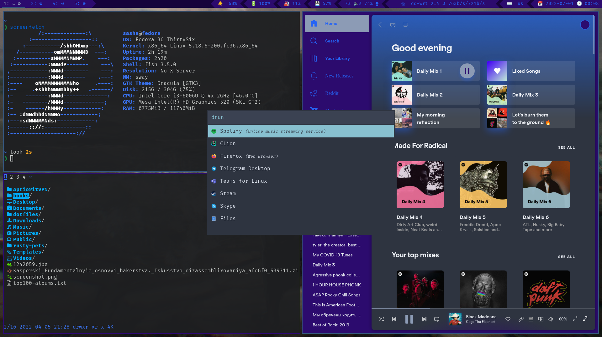

# Configuration

## `sway` - the tiling window manager.

- `swaybg` - wallpaper setter.
- `oguri` - set a .gif as wallpaper.
- `waybay` - _Wayland_ bar for _sway_.
- `light` - backlight controller.
- `pactl` - volume controller.
- `playerctl` - media players controller.
- `mako` - notifications manager.
- `nmcli` - _NetworkManager_ controller.
- `swaylock-effects` - screen locker for _Wayland_.
- `wl-paste` - clipboard manager for _Wayland_.
- `rofi(wayland patched)` - application launder.

Used scripts:

- `battery.sh` - notifies if battery level is low.
- `sway_startup.sh` - sets _environment.d_ env variables in a _sway_ session.
- `mediaplayer.py` - script for `Spotify` track title display in _waybar_ bar(it's from _waybar_ repository).

## Terminal stuff

- `alacritty` - terminal.
- `alacritty-themes` - `alacritty` themes switcher.
- `fish` - shell.
- `starship` - cross-shell prompt.
- `nnn` - terminal file manger.
- `lsd` - _Rust_ `ls` replacement.

## Rust

 - `alacritty` - terminal emulator.
 - `bat` - Rust `cat` replacement.
 - `cargo-cache` - cleanup cache produced by _Rust_.
 - `cargo-edit` - modify dependencies in _Cargo.toml_ of a _Rust_'s project from terminal.
 - `cargo-llvm-cov` - code coverage for _Rust_.
 - `cargo-sort`-  sort out a _Cargo.toml_ file.
 - `cargo-update` - update your installed via _cargo_ binaries.
 - `fd-find` - Rust `find` replacement.
 - `loc`- count lines of code.
 - `starhip` - cross-shell prompt.
 - `topgrade` - update everything that can be updated from terminal.
 - `workstyle` - dynamically rename workspaces with emoji indicate which programs.

## Other
- `flameshot` - screenshoting tool(kinda buggy on sway btw).
- `spicetify` - _Spotify_ customization. _Dribbblish_ theme with custom color scheme is used(that is called `moonlight` 😋)    
- `xdg-ninja` - A shell script which checks _$HOME_ for unwanted files and directories.

`FiraCode Nerd Font Mono` - preferred font.

